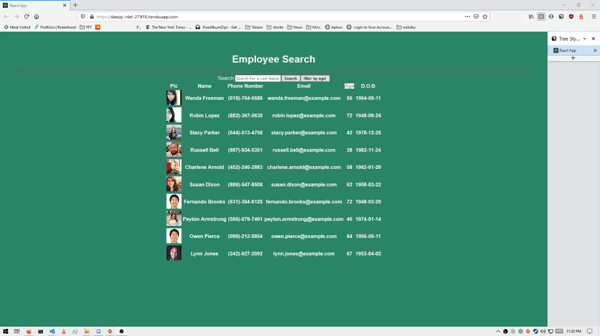

# Employee search

## Installation

npm i

npm start

  
## Description 
This application has been created with an random user API to compile a faux employee directory using React. . 

## Table of Contents 
* [Installation](#Installation)
* [Usage](#Usage)
* [Technologies](#Technologies)
* [License](#License)
* [Contributing](#Contributing)
* [Tests](#Tests)
* [Visuals](#Visuals)
* [Links](#Links)
* [Questions](#Questions)

## Installation
1. Use 'git clone'  to clone the repo
2. Install necessary dependencies with 'npm install'
3. Go to localhost:3000 to view the app

## Usage
1. The user can search the employee directory by first or last name in the input field
2. The user can click 'name' to alphabetize by first name

## Technologies
* [Random User API](https://randomuser.me/api/?results=200&nat=us)
* HTML
* CSS 
* JavaScript
* Axios 
* React.js
* Bootstrap 

## License
Copyright (c) 2020, Josh Brown. (MIT License)

## Contributing 
N/A 

## Tests
N/A

## Visuals
![screenshot of employee directory]
